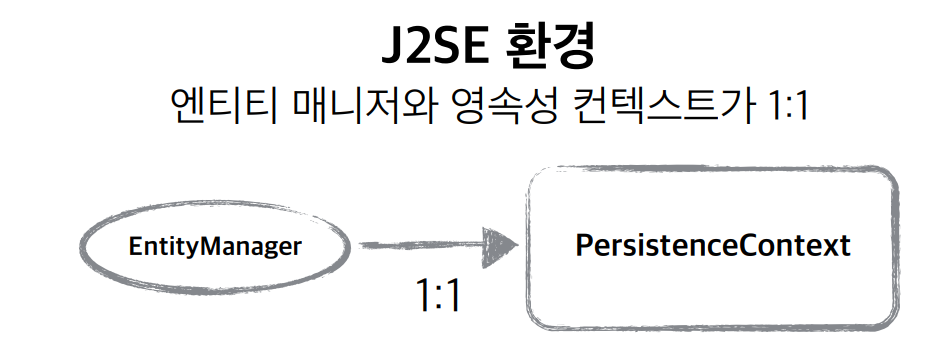
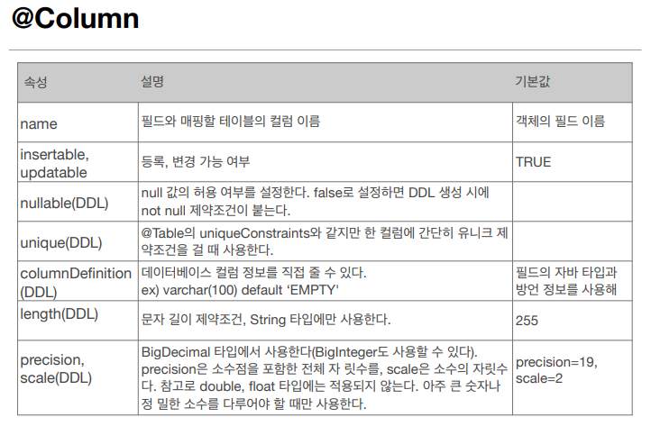
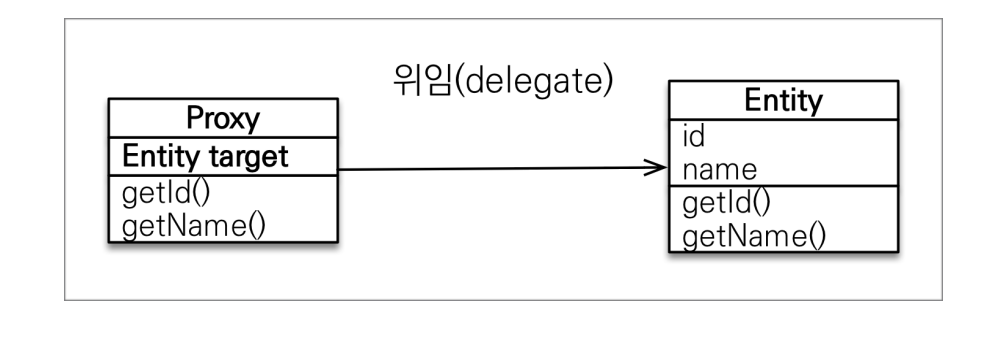
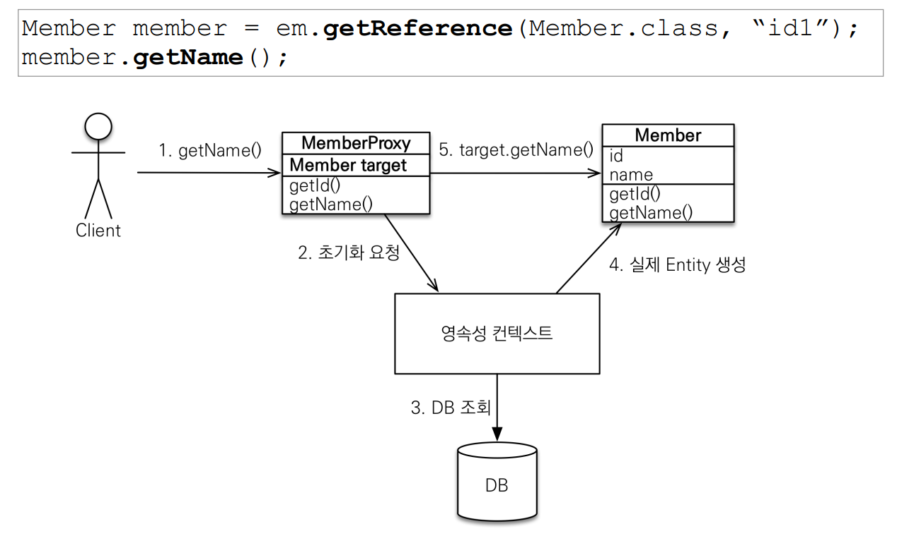
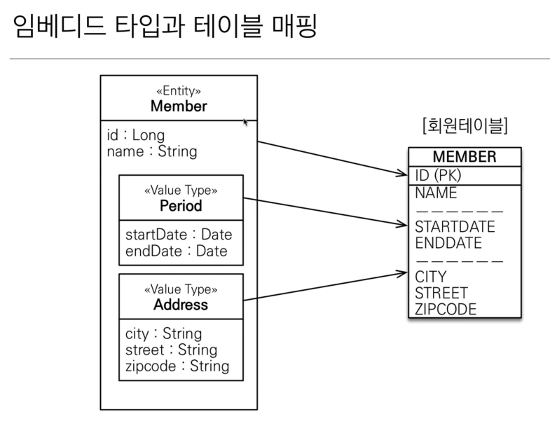

# 영속성 컨텍스트
- "엔티티를 영구 저장하는 환경"
- EntitiyManager.persist(entity);
- 이 코드가 단순히 DB에 엔티티를 만드는 것보다 더 깊은 내용을 함축한다.(엔티티를 영속성 컨텍스트에 저장한다.)
- 영속성 컨텍스트는 논리적 개념이다.(눈에 보이지 않음)
- 엔티티 매니저를 통해서 영속성 컨텍스트에 접근한다.



## 엔티티의 생명주기
1. 비영속(new/transient)
- 영속성 컨텍스트와 전혀 관계가 없는 새로운 상태

```java
Member meber = new Member();
member.setId("member1");
member.setUsername("회원1");
```

2. 영속(managed)
- 영속성 컨텍스트에 관리되는 상태

3. 준영속(detached)
- 영속성 컨텍스트에 저장되었다가 분리된 상태

4. 삭제(removed)
- 삭제된 상태

## 플러시
- 영속성 컨텍스트의 변경 내용을 데이터베이스에 반영
- em.flush()를 하게되면 변경 '쓰기 지연 SQL저장소'에 있던 SQL문들이 커밋된다.
- 이때 1차 캐시들을 그대로 유지된다.

### 영속성 컨텍스트를 플러시하는 방법
- em.flush() - 직접호출
- 트랜잭션 커밋 - 플러시 자동 호출
- JPQL 쿼리 실행 - 플러시 자동 호출

### 플러시 정리
- 영속성 컨텍스트를 비우지 않는다.
- 영속성 컨텍스트의 변경내용을 데이터베이스에 동기화시킨다.
- 트랜잭션이라는 작업 단위가 중요 -> 커밋 직전에만 동기화하면 됨
- 단, JPQL 쿼리 실행은 예외적으로 플러시를 자동으로 호출하고 코드가 실행된다.

## 영속 -> 준영속
- 영속성 컨텍스트가 관리하는 영속 상태의 엔티티가 영속성 컨텍스트에서 분리된(detached) 것을 준영속 상태라 한다.
- 준영속 상태에서는 영속성 컨텍스트가 제공하는 기능(dirty checking 등..)을 사용할 수 없다.

### 준영속 상태로 만드는 방법
- em.detach(entity) : 특정 엔티티만을 준영속 상태로 전환.
- em.clear() : 영속성 컨텍스트를 완전히 초기화.
- em.close() : 영속성 컨텍스트를 종료.

## 영속성 컨텍스트의 이점
- 1차 캐시 -같은 엔티티에 대해 find를 여러번 해도 쿼리문을 여러번 실행하지 않는다.
- 동일성 보장 - 1차 캐시에서 가져다 씀으로 참조 변수와 같이 동일성이 보장된다.(==)
- 트랜잭션을 지원하는 쓰기 지연
- 변경 감지(Dirty Checking) : 추가로 save해주지 않아도 인스턴스에 대한 참조 변수처럼 자연스럽게 데이터에 대한 update가 진행된다.
- 지연 로딩(Lazy Loading)

# 엔티티 매핑


## 객체와 테이블 매핑
- Entity가 붙은 클래스는 JPA가 관리
- JPA를 사용해서 테이블과 매핑할 클래스는 @Entity 필수
- 기본 생성자 필수(파라미터가 없는 public 또는 protected 생성자) 

## 데이터베이스 스키마 자동 생성
- 스키마란? 스키마는 데이터베이스 구조와 제약 조건에 관한 전반적인 명세를 기술한 메타데이터의 집합이다.
- hibernate.hbm2ddl.auto의 속성값을 통해 할 수 있다.
- create : 기존 테이블 삭제 후 다시 생성
- create-drop : create와 같으나 종료시점에 테이블 DROP
- update : 변경분만 반영(운영DB에서는 사용하면 안됨)
- validate : 엔티티와 테이블이 정상 매핑되었는지 확인
- none : 사용하지 않음
- 운영 장비에는 절대 create, create-drop, update 사용하면
안된다.


## 필드와 컬럼 매핑


### @Enumerated (오라클에서 체크 제약조건으로 사용자와 관리자를 구분했던 것의 기능을 한다.)
- 자바 enum 타입을 매핑할 때 사용
- ORDINAL사용 금지. (순번으로 나온다.)
- STRING으로 사용하여 이름을 데이터 베이스에 저장한다.

### @Temporal
- 날짜 타입을 매핑할 때 사용.
- LocalDate, LocalDateTime을 사용할 떄는 생략 가능(최신 하이버네이트 지원)
- TmeporalType.DATE : 날짜, 데이터베이스 date 타입과 매핑
- TemporalType.Time : 시간, 데이터베이스 time 타입과 매핑
- TemporalType.TIMESTAMP : 날짜와 시간, 데이터베이스 timestamp 타입과 매핑

### @Lob
- 데이터베이스 BLOB, CLOB 타입과 매핑
- @Lob에는 지정할 수 있는 속성이 없다.
- 매핑하는 필드 타입이 문자면 CLOB 매핑, 나머지는 BLOB 매핑

@Transient
- 필드 매핑X
- 데이터베이스에 저장X, 조회X
- 주로 메모리상에서 임시로 어떤 값을 보관하고 싶을 때 사용

## 기본 키 매핑
- 직접 할당 : @Id만 사용
- 자동 생성(@GeneratedValue)
  - IDENTITY : 데이터베이스에 위임, MYSQL
  - SEQUENCE : 데이터베이스 시퀀스 오브젝트 사용, ORACLE
    - @SequenceGenerator 필요
  - TABLE : 키 생성용 테이블 사용, 모든 DB에서 사용
    - @TableGenerator필요
  - AUTO : 방언에 따라 자동 지정, 기본값

- @Id
- @GeneratedValue

# 연관관계 매핑 기초
## 단방향 연관관계
- 객체는 참조(주소)를 사용해서 관계를 맺고 테이블은 외래 키를 사용해서 관계를 맺는다.
- 객체의 참조와 테이블의 외래 키를 매핑하는 것이 목표다.

### 방향(Direction) : [단방향, 양방향]
- 단방향 : 둘 중 한 쪽만 참조하는 것
- 양방향 : 양쪽이 모두 참조하는 것

### 다중성(Multiplicity) : [다대일(N:1), 일대다(1:N), 일대일(1:1), 다대다(N:M)]

### 연관관계의 주인(owner) : 양방향 연관관계로 만들면 연관관계의 주인을 정해야 한다. 

## 양방향 연관관계 매핑 하는 법
- 대일 중 다에 해당하는(ex Member)부분에 테이블상의 FK에 해당하는 필드에 @ManyToOne이노테이션을 달아준다.
- @JoinColumn이노테이션을 달아주고 name 속성으로 컬럼명을 명시해 준다.
- 이와 연관관계를 가지는 그 반대편 엔티티(ex Team)의 필드에 @OneToMany어노테이션과 @mappedBy속성으로 주인 엔티티의 필드값을 입력해 준다.
- 여기서 주인은 Member엔티티의 team 필드가 된다.
- 연관관계의 주인은 외래 키가 있는 곳이 된다.
- 테이블상의 외래키 데이터에 접근할 수 있는 것은 연관관계의 주인뿐이다.
- 주인이 아닌 쪽은 읽기만 할 수 있다.
- 이러한 복잡성은 테이블은 외래 키 하나로 두 테이블의 연관관계를 관리하기 때문이다.
- 반면에 엔티티는 참조를 사용하므로 양방향의 참조가 필요하다.

###  양방향 연관관계 매핑 시 주의
- 순수 객체 상태를 고려해서 항상 양쪽에 값을 설정하자
- **연관관계 편의 메소드**를 생성하자
- 양방향 매핑시에 무한 루프를 조심하자
  - 예 : toString(), lombok, JSON 생서 라이브러리

### 양방향 매핑 정리
- **단방향 매핑만으로도 이미 연관관계 매핑은 완료**
- 양방향 매핑은 반대 방향으로 조회(객체 그래프 탐색) 기능이 추가된 것 뿐
- JPQL에서 역방향으로 탐색할 일이 많음
- 단방향 매핑을 잘 하고 양방향은 필요할 때 추가해도 됨.(**테이블에 영향을 주지 않음**)

### 연관관계의 주인을 정하는 기준
- 비즈니스 로직을 기준으로 연관관계의 주인을 선택하면 안됨
- 연관관계의 주인은 외래 키의 위치를 기준으로 정해야함.

# 다양한 연관관계 매핑
- 다대일 [N:1]
- 일대다 [1:N]
- 일대일 [1:1]
- 다대다 [N:M]

## 연관관계 매핑시 고려사항 3가지
- 다중성
- 단방향, 양방향
- 연관관계의 주인

# 고급 매핑
##  상속관계 매핑
- 관계형 데이터베이스는 상속 관계X
- 슈퍼타입 서브타입 관계라는 모델링 기법이 객체 상속과 유사
- 상속관계 매핑 : 객체의 상속과 구조와 DB의 슈퍼타입 서브타입 관계를 매핑

### 슈퍼타입 서브타입 논리 모델을 실제 물리 모델로 구현하는 방법
- 각각 테이블로 변환 -> 조인 전략
- 통합 테이블로 변환 -> 단일 테이블 전략
- 서브타입 테이블로 변환 -> 구현 클래스마다 테이블 전략

## Mapped Superclass(매핑 정보 상속)
- 반복되는 필드를 한 수퍼클래스에 묶어서  @MappedSuper클래스 어노테이션을 붙여준다.

# 프록시와 연관관계 관리
## 프록시란?
- em.find() vs em.getReference()
- em.find() : 데이터베이스를 통해서 실제 엔티티 객체 조회
- em.getReference() : 데이터베이스 조회를 미루는 가짜(프록시) 엔티티 객체 조회

### 프록시 특징
- 프록시 객체는 실제 객체의 참조(target)을 보관
- 프록시 객체를 호출하면 프록시 객체는 실제 객체의 메소드 호출




중요!
1. 프록시 객체는 처음 사용할 때 한 번만 초기화
2. 프록시 객체를 초기화 할 때, 프록시 객체가 실제 엔티티로 바뀌는 것은 아님, 초기화되면 프록시 객체를 통해서 실제 엔티티에 접근 가능(target)
3. 프록시 객체는 원본 엔티티를 상속받음, 따라서 타입 체크시 주의해야함(== 비교 실패, 대신 instance of 사용)
4. 영속성 컨텍스트에 찾는 엔티티가 이미 있으면 em.getReference()를 호출해도 실제 엔티티 반환
5. 영속성 컨텍스트의 도움을 받을 수 없는 준영속 상태일 때    , 프록시를 초기화하면 문제 발생

### 프록시 확인
- 프록시 인스턴스의 초기화 여부 확인
  - PersistenceUnitUtil.isLoaded(Object entity)

## 즉시 로딩과 지연 로딩
- Member랑 Team을 따로 사용한다. - 지연로딩(Lazy)
  - 프록시 객체를 이용하여 지연로딩을 한다.
- Member랑 Team을 자주 함께 사용한다. - 즉시로딩(EAGER)
  - DB에서 진짜 객체를 가져온다.
- 단,! 실무에서는 지연로딩만 사용하면 된다.
 
### 프록시와 즉시로딩 주의
- 가급적 지연 로딩만 사용
- 즉시 로딩을 적용하면 예상하지 못한 SQL이 발생
- 즉시 로딩은 JPQL에서 N+1 문제를 일으킨다.
- @ManytoOne, @OneToOne은 기본이 즉시 로딩 -> LAZY로 설정

## 영속성 전이(CASCADE)와 고아 객체
- 특정 엔티티를 영속 상태로 만들 때 연관된 엔티티도 함께 영속상태로 만들고 싶을 때

### 영속성 전이 + 고아 객체, 생명주기
- CascadeType.All + orphanRemovel=true
- 스스로 생명주기를 관리하는 엔티티는 em.persist()로 영속화, em.remove()로 제거
- 두 옵션을 모두 활성화 하면 부모 엔티티를 통해서 자식의 생명주기를 관리할 수 있음
- 도메인 주도 설계(DDD)의 Aggregate Root개념을 구현할 때 유용

## 실습
### 글로벌 페치 전략 설정
- 모든 연관관계를 지연 로딩으로
- @ManyToOne, @OneToOne은 기본이 즉시 로딩이므로 지연 로딩으로 변경

### 영속성 전이 설정
- Order -> Delivery를 영속성 전이 ALL 설정
- Order -> OrderItem을 영속성 전이 ALL 설정

# 값 타입
## 기본값 타입
## 임베디드 타입
- 새로운 값 타입을 직접 정의할 수 있음
- JPA는 임베디드 타입(embedded type)이라 함
- 주로 기본 값 타입을 모아서 만들어서 복합 값 타입이라고도 함
- int, String과 같은 값 타입 

### 임베디드 타입 사용법
- @Embeddable: 값 타입을 정의하는 곳에 표시
- @Embedded: 값 타입을 사용하는 곳에 표시
- 기본 생성자 필수

### 임베디드 타입의 장점
- 재사용
- 높은 응집도
- Period.isWork()처럼 해당 값 타입만 사용하는 의미 있는 메소드를 만들 수 있음
- 임베디드 타입을 포함한 모든 값 타입은, 값 타입을 소유한 엔티티에 생명주기를 의존함



### 임베디드 타입과 매핑
- 임베디드 타입은 엔티티의 값일 뿐이다.
- 임베디드 타입을 사용하기 전과 후에 **매핑하는 테이블은 같다**.(DB상 변화가 없음)
- 객체와 테이블을 아주 세밀하게(find-grained) 매핑하는 것이 가능하다.
- 잘 설계한 ORM 애플리케이션은 매핑한 테이블의 수보다 클래스의 수가 더 많음

## 값 타입과 불변 객체

- 값 타입의 실제 인스턴스인 값을 공유하는 것은 위험
- 대신 값(인스턴스)를 복사해서 사용
  
### 객체 타입의 한계
- 항상 값을 복사해서 사용하면 공유 참조로 인해 발생하는 부작용을 피할 수 있다.
- 그런데, 문제는 임베디드 타입처럼 직접 정의한 값 타입은 자바의 기본 타입이 아니라 객체 타입이다.
- 자바 기본 타입에 값을 대입하면 값을 복사한다.
- 객체 타입은 참조 값을 직접 대입하는 것을 막을 방법이 없다.
- 객체의 공유 참조는 피할 수 없다.

### 불변 객체
- 객체 타입을 수정할 수 없게 만들면 부작용을 원천 차단
- 값 타입은 불변 객체(immutable object)로 설계해야함
- 불변 객체 : 생성 시점 이후 절대 값을 변경할 수 없는 객체
- 생성자로만 값을 설정하고 수정자(Setter)를 만들지 않으면 됨
- 참고 : Integer, String은 자바가 제공하는 대표적인 불변 객체이다.

## 값 타입의 비교
- 동일성(identity) 비교 : 인스턴스의 참조 값을 비교, == 사용
- 동등성(equivalentce) 비교 : 인스턴스의 값을 비교, equals()사용
- 값 타입은 a.equals(b)를 사용해서 동등성 비교를 해야 함
- 값 타입의 equals()메소드를 적절하게 재정의(주로 모든 필드 사용)

## 값 타입 컬렉션
- 값 타입을 하나 이상 저장할 때 사용
- @ElementCollection, @CollectionTable사용
- 데이터베이스는 컬렉션을 같은 테이블에 저장할 수 없다.
- 컬렉션을 저장하기 위한 별도의 테이블이 필요함

### 값 타입 컬렉션의 제약사항
- 값 타입은 엔티티와 다르게 식별자 개념이 없다.
- 값은 변경하면 추적이 어렵다.
- 값 타입 컬렉션에 변경 사항이 발생하면, 주인 엔티티와 연관된 모든 데이터를 삭제하고, 값 타입 컬렉션에 있는 현재 값을 모두 다시 저장한다.
- 값 타입 컬렉션을 매핑하는 테이블은 모든 컬럼을 묶어서 기본키를 구성해야 함" null 입력x, 중복 저장x

### 값 타임 컬렉션 대안
- 실무에서는 상황에 따라 값 타입 컬렉션 대신에 일대다 관계를 고려
- 일대다 관계를 위한 엔티티를 만들고, 여기에서 값 타입을 사용
- 영속성 전이(Cascade) + 고아 객체 제거를 사용해서 값 타입 컬렉션 처럼 사용

###  엔티티 타입 VS 값 타입
- 엔티티 타입의 특징
  - 식별자O
  - 생명 주기 관리
  - 공유
- 값 타입의 특징
  - 식별자X
  - 생명 주기를 엔티티에 의존
  - 공유하지 않는 것이 안전(복사해서 사용)
  - 불변 객체로 만드는 것이 안전

## 객체지향 쿼리 언어1 - 기본 문법

### JPA는 다양한 쿼리 방법을 지원
- JPQL
- JPA Criteria
- QueryDSL
- 네이티브 SQL
- JDBC API 직접 사용, MyBatis, SpringJdbcTemplate 함께 사용

### JPQL
- JPA에서 제공하는 SQL의 추상화된 방법 (객체지향 적으로)
- JPQL은 엔티티 객체를 대상으로 쿼리
- SQL은 데이터베이스 테이블을 대상으로 쿼리
- 객체 지향 SQL

### TypeQuery, Query
- TypeQuery : 반환 타입이 명확할 때 사용
- Query : 반환 타입이 명확하지 않을 때 사용

```java

TypedQuery<Member> query = em.createQuery("select m from Member m", Member.class);

Query query = em.createQuery("SELECT m.username, m.age from Member m");


```

### 결과 조회 API
- query.getResultList(): 결과가 하나 이상일 때, 리스트 반환
  - 결과가 없으면 빈 리스트 반환

- query.getSingleResult(): 결과가 정확히 하나, 단일 객체 반환
  - 결과가 없으면 : javax.persistence.NoResultException
  - 둘 이상이면 : javax.persistence.NonUniqueResultException

### 파라미터 바인딩 - 이름 기준(권장), 위치 기준
- 이름 기준
``` java

select m from Member m where m.username = **:username**
query.setParameter("username", username의 값);

```

- 위치 기준
``` java

select m from Member m where m.username = **?1**
query.setParameter(1, username의 값);

```
