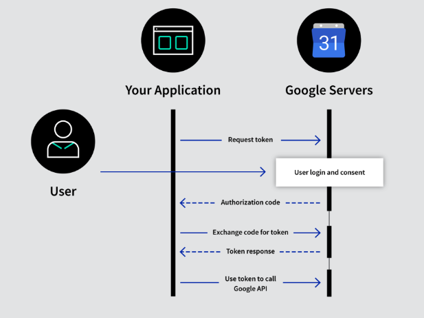

# OAuth2 ?
> 인증을 위한 개방형 표준 프로토콜, 제 3의 프로그램에게 리소스 소유자를 대신하여 리소스 서버에서 제공하는 자원에 대한 접근 권한을 위임하는 방식

## 역할
1. Resource Server[Authorization Server], 
- 구글
2. Resource Ownver
- 유저
3. Client
- 제 3의 서비스 및 어플리케이션

