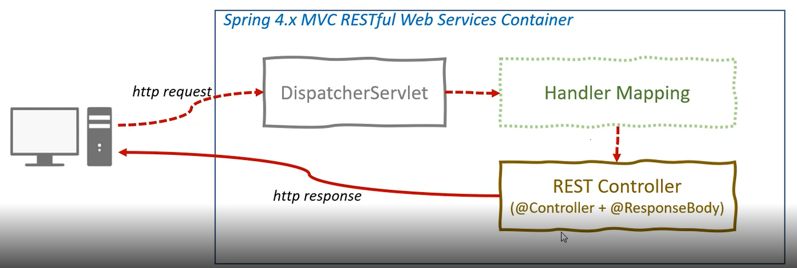

## application.yml or application.properties
- application.properties -> 설정이름 = 값
- application.yml -> 설정이름:값

## DispatcherServlet
- dispatch : (정보나 메세지를) 보내다.
- 일종의 게이트
- 클라이언트의 모든 요청을 한곳으로 받아서 처리
- 요청에 맞는 Handler로 요청을 전달

## HttpMessageConvertersAutoConfiguration
- Json포맷으로 변경 

## RestController
- Spring4 부터 @RestController 지원
- @Controller + @ResponseBody
- Rest API서비스는 뷰를 가지는 서비스가 아니라 XML이나 JSON파일과 같은 데이터 포맷으로 데이터를 전달.

