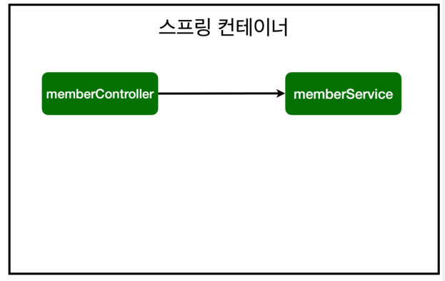
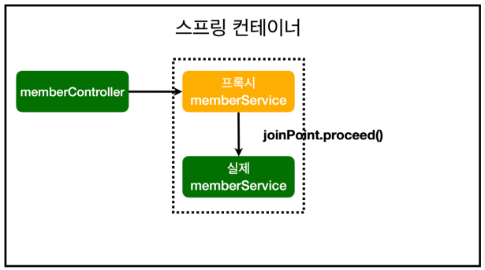
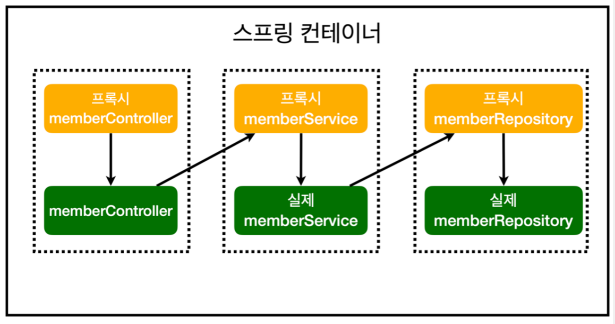

# AOP(Aspect Oriented Programming)
- 공통 관심 사항(cross-cutting concern) vs 핵심 관심 사항(core concern)을 분리하여 작업한다.
- 회원가입, 회원 조회등 핵심 관심사항과 시간을 측정하는 공통 관심 사항을 분리한다.
- 시간을 측정하는 로직을 별도의 공통 로직으로 만든다.
- 핵심 관심 사항과 공통 관심 사항을 분리하여 논리적 비즈니스 로직에 집중할 수 있다.

스프링 AOP 동작 방식

- AOP 적용 전 의존관계

- AOP 적용 후 의존관계

- AOP 적용 후 전체그림
